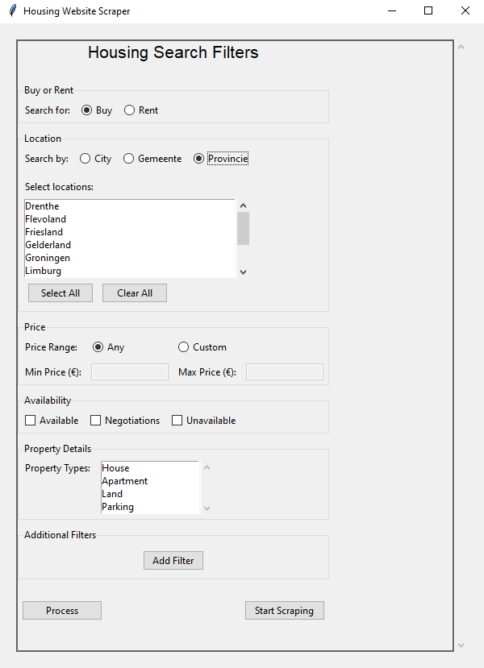
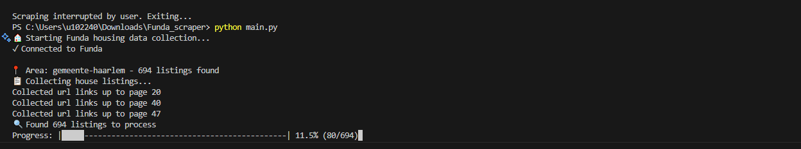
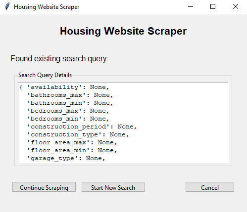

# 🏠 Funda_Scraper

**Funda_Scraper** is your go-to tool for scraping housing data from **Funda**, the Dutch real estate platform. Whether you're looking for properties **for sale** or **for rent**, or exploring historical housing trends from the past few years, Funda_Scraper makes it simple and (hopefully) efficient.

---

### ⚠️ Important Notes

- **Personal Use Only**: Scraping Funda is permitted **only for personal use**, as outlined in Funda's Terms and Conditions.
- **No Commercial Use**: Any commercial use of this package is strictly prohibited.
- **Disclaimer**: The author is not liable for any misuse of this tool. Use it responsibly!

---

## ✨ Features

- **Asynchronous Scraping**: Utilizes `asyncio` for concurrent web requests, combined with `curl_cffi` for undetected scraping.
- **Scraping by Batch**: Control how many ads are processed at once by adjusting `self.batch_processing_size` in `Scraper/config.py`. Increase the number for faster scraping, but be cautious—larger batches may increase the risk of your IP getting blocked.
- **User-Friendly Interface**: An intuitive interface within the code for easy configuration and execution.

---

## 🛠️ Installation

**Clone the repository**:
````
git clone https://github.com/YoussefBJemia/Funda_scraper
cd Funda_scraper
pip install -r requirements.txt
python Funda_scraper/main.py
````

---

## 🚀 Usage

1. **Start Scraping**:
   Run the main script to begin scraping:
   ````
   python main.py
   ````
   This will launch the Graphical User Interface (GUI).

   
2. **Start Scraping**

Click the **"Start Scraping"** button in the GUI to begin the process.

The scraper will start running, and you can monitor its progress in the terminal or command line.

 <!-- Replace with actual path -->

3. **Resumable Scraping**

- Ads are saved automatically whenever a neighborhood is fully processed.
- If the program is stopped, it can resume from where it left off, ensuring no data is lost.

 <!-- Replace with actual path -->
